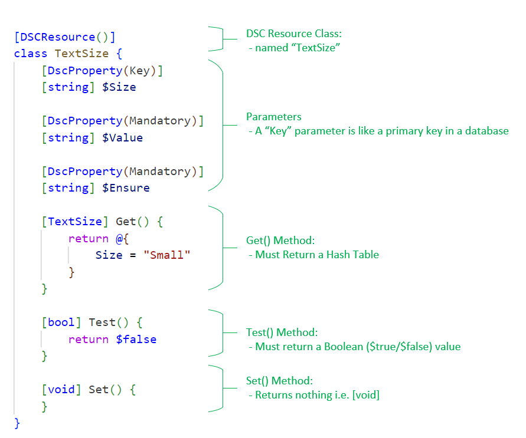

# Creating a DSC Resource


## Basic Structure
The basic structure of a DSC class consists of the following:

- Class Name
- Parameters
- a Get() method
- a Test() method
- a Set() method

<ins>Example:</ins>

```powershell
	[DSCResource()]
	class TextSize {
		[DscProperty(Key)]
		[string] $Size

		[DscProperty(Mandatory)]
		[string] $Value

		[DscProperty(Mandatory)]
		[string] $Ensure

		[TextSize] Get() {
			return @{
				Size = "Small"
			}
		}
		
		[bool] Test() {
			return $false
		}

		[void] Set() {
		}
	}
```

<!--  -->

# 


## Get() Method:
The Get() method is used to return the current state.

It must return a hash table.

<ins>Example:</ins>

```powershell
	if (Test-Path -Path $this.RegistryKey) {
		### Get the current value from the registry
		$currentTextSizeValue = Get-ItemProperty -Path $this.RegistryKey -Name $this.RegistryValue -ErrorAction SilentlyContinue `
			| Select-Object -ExpandProperty $this.RegistryValue
	}
	else {
		$currentTextSizeValue = $null
	}
	return @{
		CurrentTextSize = $this.$currentTextSizeValue
	}
```


## Test() Method:
The Test() method tests whether the current state matches the desired state.

Must return a [bool] True/False value.

To do this, we get the Current sate, and compare it with the Desired state.

<b>Note: </b>

In this example we are using the Get() method described in the the same class to return the current state.


<ins>Example:</ins>

```powershell
	[bool] Test() {
		$currentTestSizeValue = $this.Get()
		return $currentTestSizeValue.TextSize -eq $this.TextSize
	}
``````

## Set() Method:

The Set() method set the desired state.

Note: Since DSC is idempotent, the set method is only executed if the Test() method return $false.


<ins>Example:</ins>

```powershell

``````

### Using enums

```powershell
enum TextSizeEnum {
	Small = 96
	Medium = 120
	Large = 144
	ExtraLarge = 192
}
```


## Parameters


### Key
In the context of PowerShell Desired State Configuration (DSC), [DscProperty(Key)] is an attribute that marks a property as a key property in a DSC resource.

A key property is used to uniquely identify a resource instance. It's similar to a primary key in a database. The values of key properties must be unique for each instance of a resource.

For example, if you have a DSC resource for managing files, the file path could be a key property because it uniquely identifies each file.

In your code, [DscProperty(Key)] is marking the property that follows it as a key property.


## Testing a DSC Resource